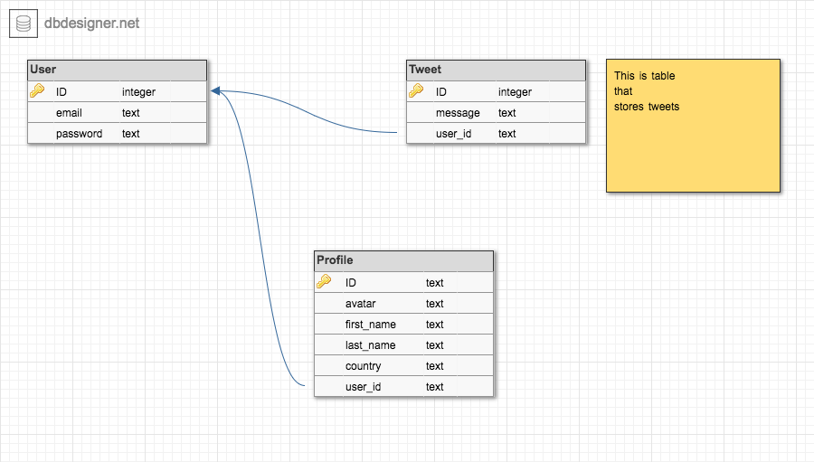

# README

# Database
## ERD (Enitity Relationship Diagram)

# DB Tables

I made 3 tables for my app, User, Tweet and profile. User stores the user information like a password etc. Tweet stores the information message that a user tweets and Profile table stores information about the user. Each user has a one profile and many Tweets.

## User  

  - email
  - password

## Profile
  - avatar
  - first_name
  - last_name
  - country
  - user_id (belongs_to)

## Tweet
  - message
  - user_id (belongs_to)

# Pages
## homepage

  - tweets on page
  - log in / log out

## tweet show page

  - see tweet 
  - edit tweet (if logged in)

## profile page

  - first_name
  - last_name
  - avatar
  - tweet count
  - country 
  - editability

# Wireframe

